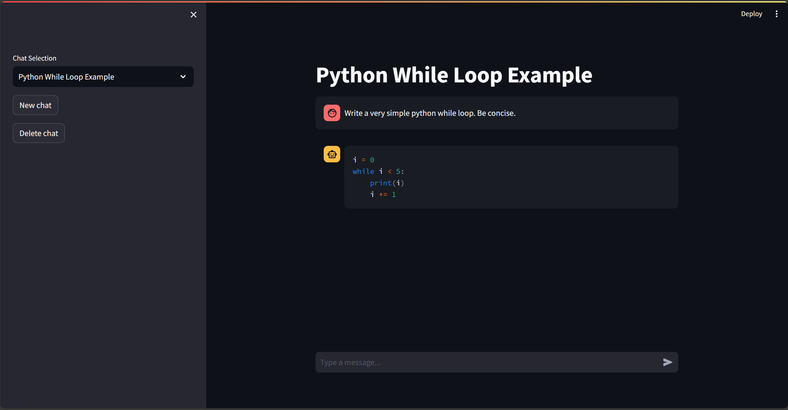

<p align="center" style="background-color: transparent;">
  
</p>


# Streamlit with Prompt flow Demo
<p align="center" style="background-color: transparent;">
  
</p>


This project demonstrates how to use [Streamlit](https://streamlit.io/) to build a simple chat app that uses [Prompt flow](https://microsoft.github.io/promptflow) to generate responses with a model deployed in Azure OpenAI Service. The app uses two flows:
1. [chat](flows/chat) - for generating responses to user input given the context of the conversation
2. [make_title](flows/make_title/) - for generating a title for a conversation using the initial user question

# Install dependencies
You can install the dependencies using pip:
```bash
pip install -r requirements.txt
```

# Azure OpenAI Service
The requires access to an existing Azure OpenAI Service deployment with API access.

By default, the app expects a deployment with name `gpt-4-turbo`.

You can change this in [flows/chat/flow.dag.yaml](flows/chat/flow.dag.yaml) and [flows/make_title/flow.dag.yaml](flows/make_title/flow.dag.yaml) by setting the `deployment_name`.

# Environment variables
You must set the following environment variables:
- `OPENAI_API_KEY` - The API key for your Azure OpenAI Service resource
- `OPENAI_API_BASE` - The base URL for your Azure OpenAI Service resource in the form `https://<resource-name>.openai.azure.com`

# Run the app locally
You can run the app using the following command:
```bash
streamlit run app.py
```

# Deploy the app
The repository uses Pulumi and GitHub actions to deploy the app to Azure App Service. To run the GitHub actions workflow, you must set the following secrets:
- `ARM_CLIENT_ID` - The client ID of the service principal used to deploy the app
- `ARM_CLIENT_SECRET` - The client secret of the service principal used to deploy the app
- `ARM_LOCATION_NAME` - The Azure region to deploy the app to
- `ARM_SUBSCRIPTION_ID` - The Azure subscription ID to deploy the app to
- `ARM_TENANT_ID` - The Azure tenant ID to deploy the app to
- `OPENAI_API_BASE` - The base URL for your Azure OpenAI Service resource in the form `https://<resource-name>.openai.azure.com`
- `OPENAI_API_KEY` - The API key for your Azure OpenAI Service resource
- `PULUMI_ACCESS_TOKEN` - The Pulumi access token to use for deployment

Your service principal must have the ability to create to app registrations and managed identities.